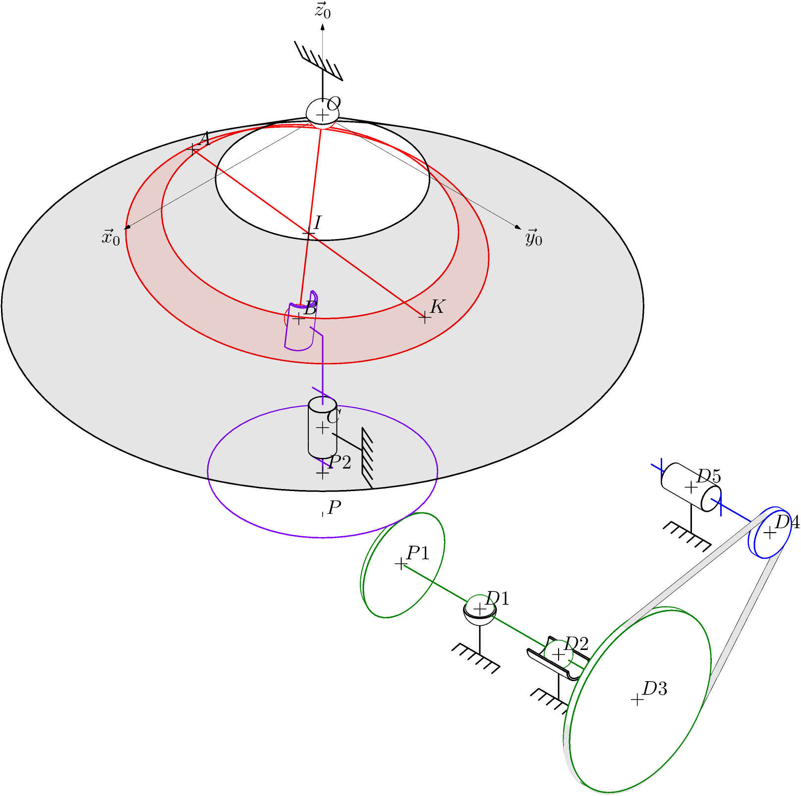

# Bibilothèque 3d/2d de schémas cinématiques /  Library 3d/2d kinematic diagrams

## Description

### English
The purpose of this library is to draw kinematic diagrams in 3D and 2D using the same commands. The different output formats are pdf and png. This library uses the Asymptote language, so it is perfectly compatible with LaTeX. What's more, since the schematic is coded, you can animate your diagrams.

### Français
Cette bibliothèque a pour objectif de tracer en 3d et 2d des schémas cinématiques avec les mêmes commandes. Les différents formats de sortie sont notamment pdf et png. C'est une bibliothèque utilisant le langage Asymptote, par conséquent elle est parfaitement intégrable à LaTeX. De plus, comme on code le schéma cinématique, vous pourrez animer vos schémas.

## Quick Gallery 
> [!TIP]
> click on the image to bring you to the max resolution image.

- Sinusmatic
 

- I3D
 

- concasseur de galets

- and more to view in the examples folder [examples](./examples/).

## Installation and use

### English
For all information, see the documentation.pdf file.

### Français
Pour toute information, voir le fichier documentation.pdf.

## License / Licence
### English
Distributed under the GNU License. See LICENSE for more information.
### Français
Distribué sous la licence GNU. Voir LICENSE pour plus d'informations.